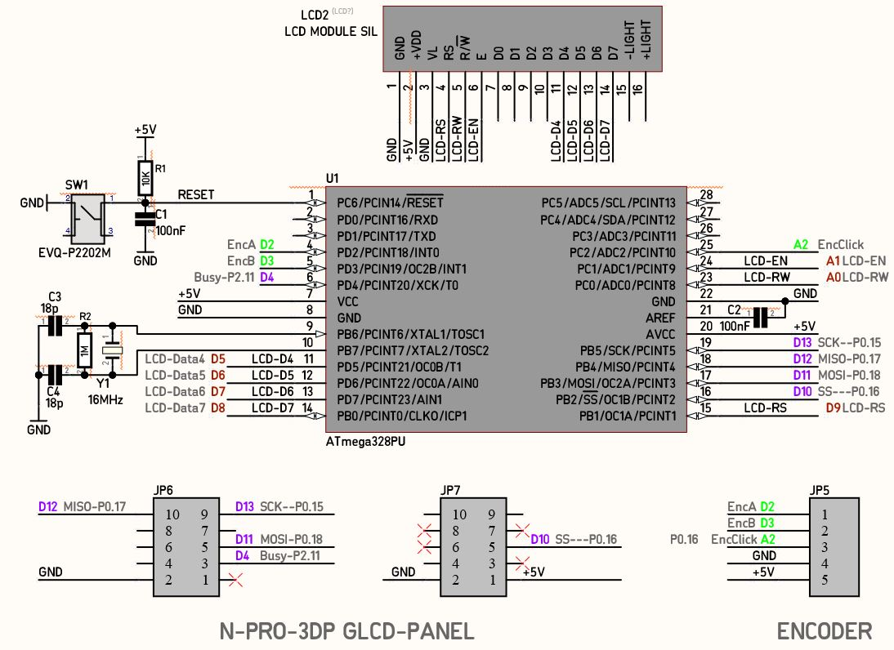

# prj_UPA_minimal: 
####  Easy to get, parallel 20x4 LCD, with Smoothieware 
####  Minimal and tidy hardware for Universal Panel Adapter firmware 

---
[Smoothieware](http://smoothieware.org/smoothieboard) does not have an option for driving character LCD. It can only drive graphical SPI LCDs.
This is probably due to lack of GPIO pins (Ethernet functionality is using a lot of GPIO…)

Smoothieboard developer offers an [add-on board](http://smoothieware.org/rrdglcdadapter), that can translate the SPI bitstream for 
I2C LCD and (The more common) parallel LCD.  
This board has a complex shape and fits only on Smoothieboard,
but
The firmware is open source, called Universal Panel Adapter (UPA), is available in Github 
and 
can be used with Arduino boards or a plain ATmega328 microprocessor. 

On this small project [prj_UPA_minimal]([https://github.com/nikoschalikias/prj_UPA_minimal) we deploy UPA firmware on a minimal and tidy implementation, to be used with a 3D printer controller with SPI only GLCD interface like [n-PRO-3DP](https://www.n-blocks.net/nmodules/doku.php?id=nblocks:ni-pro-3dp), [SmoothieBoard](http://smoothieware.org/smoothieboard) and other boards driven by Smoothieware.  
With the UPA minimal Board, any 20x4 LCD can be used with Smoothieware.

The Board is developed in iterations: starting with a Breadboard first iteration, a perforated-board 2nd iteration and ending with a PCB

---
Block Diagram

---
1st  implemetation with Arduino-Nano on breadboard, to be replaced with the Minimal version

---
Minimal Schematic, 2nd iteration

---
Minimal Perforated-Board, 2nd iteration

---
Work in progress: 3nd iteration

---

Nikos  notes on compilation
---------------------
To have a succesful compilation with Arduino IDE 1.8.11, for the Parallel LCD, I did the following:
* Included all dependencies in the project folder
* Changed some instances like #include <Encoder.h>, to #include "Encoder.h"
* Replaced  all references to wiring.h with wiring_private.h  

Links:
* http://smoothieware.org/panel
* https://stackoverflow.com/questions/42826755/wiring-h-missing-in-arduino/42827754
* https://github.com/nikoschalikias/firm-universal-panel-adapter

---
Below is the readme file from [wolfmanjm firmware: universal-panel-adapter](https://github.com/wolfmanjm/universal-panel-adapter)

universal-panel-adapter
=======================

Using a cheap Arduino mini pro, uno or nano this sketch allows you to
interface a panel like Viki or a Parallel LCD with encoder via SPI.

Specifically used for running I2C and parallel panels on a Smoothie compatible board.

Prebuild bianries ready for upload to arduino are:-

* viki_panel_adapter.hex for viki/panelolu2
* parallel_panel_adapter.hex for parallel LCD

Default Wiring is as follows:-

Viki to Nano
---------------

	SDA  -> A4
	SCL  -> A5
	ENCA -> D2
	ENCB -> D3
	Gnd  -> Gnd
	+5v  -> +5v

Parallel LCD pin to Nano
--------------------

	 4 RS -> D9
	 5 RW -> A0
	 6 EN -> A1
	11 D4 -> D5
	12 D5 -> D6
	13 D6 -> D7
	14 D7 -> D8

	 1 gnd
	 2 +5v
	 3 contrast
	 15,16 backlight power (on some)
	 
 	Encoder is connected to Nano
	ENCA  -> D2
	ENCB  -> D3
	Click -> A2

Smoothie to Nano
----------------
	MOSI -> D11 : 0.18
	MISO -> D12 : 0.17
	SCK  -> D13 : 0.15
	SS   -> D10 : 0.16
	BUSY -> D4  : 2.11 (or 1.30 on Azteeg X5) (And set panel.busy_pin in config to that pin)

Smoothie config
---------------

add this to your config file on smoothie

	panel.enable                                true              # enable panel
	panel.lcd                                   universal_adapter #
	panel.spi_channel                           0                 # spi channel to use (0- MISO 0.17, MOSI 0.18, SCK 0.15, SS 0.16)
	panel.spi_cs_pin                            0.16              # spi chip select
	panel.busy_pin                              2.11              # busy pin NOTE 1.30 on Azteeg X5

Requirements
------------
For compiling the following Arduino libraries are needed

* Encoder library from http://www.pjrc.com/teensy/td_libs_Encoder.html

For Viki and I2C based panels
* LiquidTWI2 from https://github.com/lincomatic/LiquidTWI2

For Parallel panels
* LiquidCrystalFast from https://www.pjrc.com/teensy/td_libs_LiquidCrystal.html

