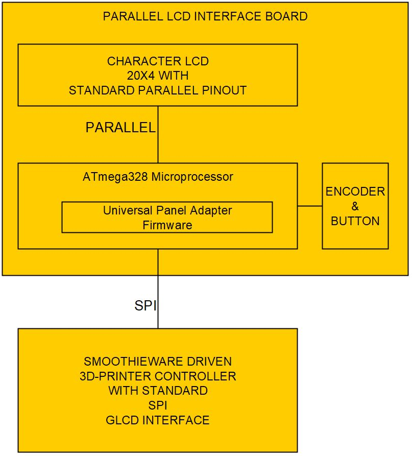
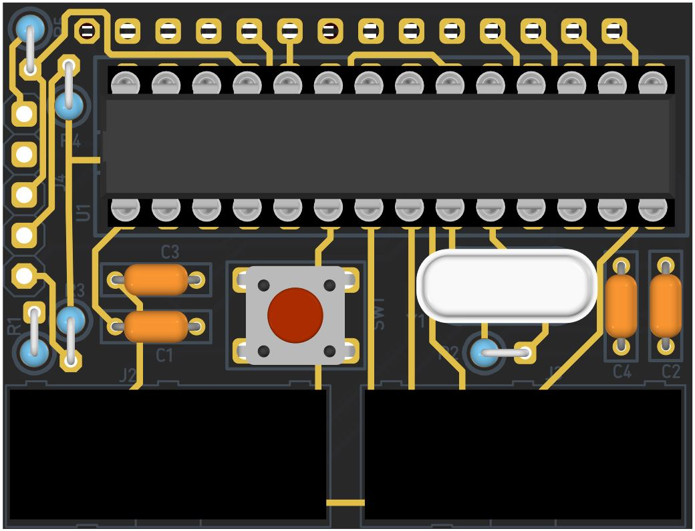
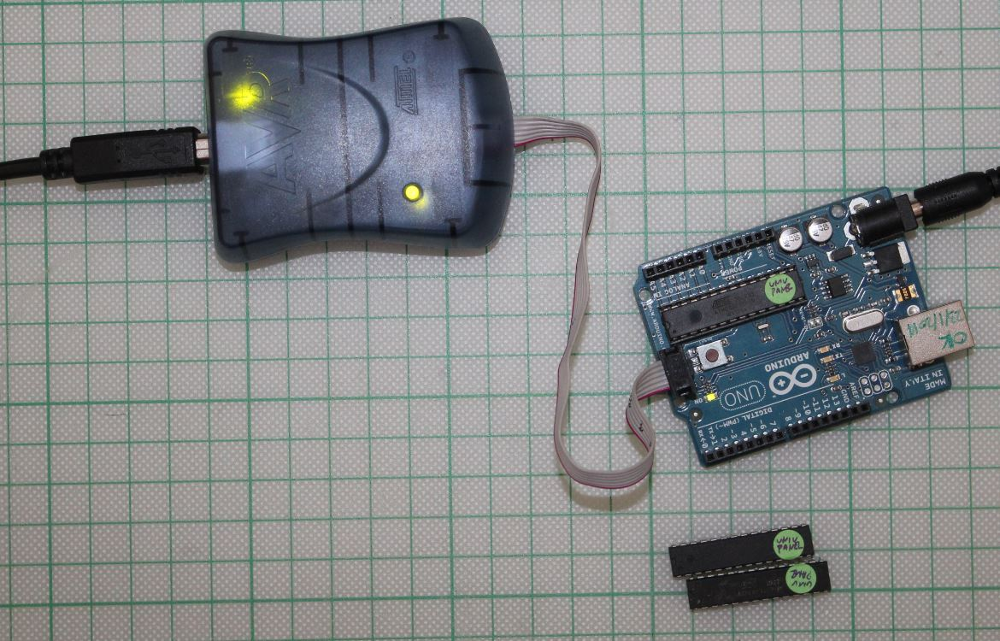
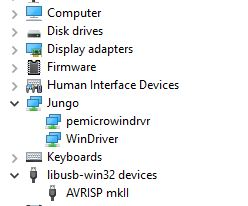

# [prj_UPA_minimal](https://github.com/Motion-Controller/prj_UPA_minimal): 
####  Easy to get, parallel 20x4 LCD, with Smoothieware 
####  Minimal and tidy hardware for Universal Panel Adapter firmware 


---
###### The Problem:
[Smoothieware](http://smoothieware.org/smoothieboard) does not have an option for driving character LCDs with Parallel interface. It can only drive graphical SPI LCDs.
This is probably due to lack of GPIO pins (Ethernet functionality is using a lot of GPIO…)

Smoothieboard developer offers an [add-on board](http://smoothieware.org/rrdglcdadapter), that can translate the SPI-bitstream to I2C-LCD or to (The more common) parallel-LCD.  
This board has a complex shape and fits only on Smoothieboard. The firmware is open source, called Universal Panel Adapter (UPA) and  is available in Github 


###### A Solution:  
UPA firmware can be used with Arduino boards or a plain ATmega328 microprocessor. 
On this small project [prj_UPA_minimal]([https://github.com/nikoschalikias/prj_UPA_minimal), we deploy UPA firmware on a minimal and tidy hardware implementation, to be used with a 3D printer controller with SPI only GLCD interface like [n-PRO-3DP](https://www.n-blocks.net/nmodules/doku.php?id=nblocks:ni-pro-3dp), [SmoothieBoard](http://smoothieware.org/smoothieboard) and other boards driven by Smoothieware.  
With the UPA minimal Board, common 20x4 LCDs can be used with Smoothieware.


The Board is developed in iterations: starting with a Breadboard 1st iteration, a perforated-board 2nd iteration and  a PCB 3d iteration

---
**Block Diagram**




---
**1st  iteration:** with Arduino-Nano on breadboard, to be replaced with the Minimal version


---
**2nd iteration:** Minimal Schematic implementation in a 43mm x 33mm n-Blocks perforated board


    

---
**3nd iteration:** Minimal Schematic implemented in a 43mm x 33mm n-Blocks form factor PCB [UPA-DIP](https://github.com/nikoschalikias/UPA-DIP)


            

 

---
**Integration:** 3D model of a 3Dprinter controller with UPA-DAP


        

----

Testing 3d iteration PCB
* Display is working :heavy_check_mark:
* Encoder is working :x:
* 3D printing is working :x:


---

##### Nikos notes on first time compilation   
**Arduino IDE 1.8.11**

To have a succesful compilation with Arduino IDE 1.8.11, for the Parallel LCD, I did the following:
* Included all dependencies in the project folder
* Changed some instances like #include <Encoder.h>, to #include "Encoder.h"
* Replaced  all references to wiring.h with wiring_private.h  

Links:
* http://smoothieware.org/panel
* https://stackoverflow.com/questions/42826755/wiring-h-missing-in-arduino/42827754
* https://github.com/nikoschalikias/firm-universal-panel-adapter

---
##### Nikos notes on build without the Arduino IDE 
**arduino-cli 0.1**  

My intention was to use a windows command file to automate the building process from command line.  
Then I discovered the arduino-cli, which seems to work smoothly, so  
I managed to build with arduino-cli (easier than using the IDE) as below:     

I downloaded  the Nightly Windows 64 bit binary [here](https://arduino.github.io/arduino-cli/installation/) at 'Download a nightly build' section  
and  
copied `arduino-cli.exe` to project folder root (temporary). It is 12MBytes so I excluded (added to .gitignore) it from version control.    
Then following [arduino-cli getting started](https://arduino.github.io/arduino-cli/getting-started/), I set up the arduino environment...  
```
arduino-cli config init
```
probably above is not needed.  
Install avr tools...
```
cli core install arduino:avr
```
...then list the installed platforms...
```
arduino-cli core list
    F:\prj_soft\repo.arduino\prj_UPA_minimal - Copy>arduino-cli core list
    ID          Installed Latest Name
    STM32:stm32 1.8.0     1.8.0
    arduino:avr 1.8.2     1.8.2  Arduino AVR Boards
    esp32:esp32 1.0.4     1.0.4
```
...And finally compile:
```	
arduino-cli compile --fqbn arduino:avr:uno prj_UPA_minimal.ino
	Sketch uses 4802 bytes (14%) of program storage space. Maximum is 32256 bytes.
	Global variables use 1336 bytes (65%) of dynamic memory, leaving 712 bytes for local variables. Maximum is 2048 bytes.
```


---

##### Nikos notes on uploading with AVR-MKII from command line   
**Arduino IDE 1.8.11**




Uploading to Microprocessor (ATmega328AP) Flash is accomplished with AVRDUDE, which comes with Arduino IDE:  
In my installation avrdude.exe is here: ```"C:\Program Files (x86)\Arduino\hardware\tools\avr\bin\avrdude"```  

The configuration file for AVRDUDE is here: ```"C:\Program Files (x86)\Arduino\hardware\tools\avr\etc\avrdude.conf"```
and is created from Arduino IDE

I call burn-hex.cmd with content:  
```"C:\Program Files (x86)\Arduino\hardware\tools\avr\bin\avrdude" -C "C:\Program Files (x86)\Arduino\hardware\tools\avr\etc\avrdude.conf" -v -p atmega328P -c stk500v2 -Pusb -U flash:w:"F:\prj_soft\repo.arduino\prj_UPA_minimal\prj_UPA_minimal.ino.standard.hex":i```   
This creates below output on the screen or in a file using ```burn-hex.cmd > a.txt 2>&1``` 


```
F:\prj_soft\repo.arduino\prj_UPA_minimal>"C:\Program Files (x86)\Arduino\hardware\tools\avr\bin\avrdude" -C "C:\Program Files (x86)\Arduino\hardware\tools\avr\etc\avrdude.conf" -v -p atmega328P -c stk500v2 -Pusb -U flash:w:"F:\prj_soft\repo.arduino\prj_UPA_minimal\prj_UPA_minimal.ino.standard.hex":i  

avrdude: Version 6.3-20190619
         Copyright (c) 2000-2005 Brian Dean, http://www.bdmicro.com/
         Copyright (c) 2007-2014 Joerg Wunsch

         System wide configuration file is "C:\Program Files (x86)\Arduino\hardware\tools\avr\etc\avrdude.conf"

         Using Port                    : usb
         Using Programmer              : stk500v2
avrdude: usbdev_open(): Found AVRISP mkII, serno: FFFFFFFFFFFF
         AVR Part                      : ATmega328P
         Chip Erase delay              : 9000 us
         PAGEL                         : PD7
         BS2                           : PC2
         RESET disposition             : dedicated
         RETRY pulse                   : SCK
         serial program mode           : yes
         parallel program mode         : yes
         Timeout                       : 200
         StabDelay                     : 100
         CmdexeDelay                   : 25
         SyncLoops                     : 32
         ByteDelay                     : 0
         PollIndex                     : 3
         PollValue                     : 0x53
         Memory Detail                 :

                                  Block Poll               Page                       Polled
           Memory Type Mode Delay Size  Indx Paged  Size   Size #Pages MinW  MaxW   ReadBack
           ----------- ---- ----- ----- ---- ------ ------ ---- ------ ----- ----- ---------
           eeprom        65    20     4    0 no       1024    4      0  3600  3600 0xff 0xff
           flash         65     6   128    0 yes     32768  128    256  4500  4500 0xff 0xff
           lfuse          0     0     0    0 no          1    0      0  4500  4500 0x00 0x00
           hfuse          0     0     0    0 no          1    0      0  4500  4500 0x00 0x00
           efuse          0     0     0    0 no          1    0      0  4500  4500 0x00 0x00
           lock           0     0     0    0 no          1    0      0  4500  4500 0x00 0x00
           calibration    0     0     0    0 no          1    0      0     0     0 0x00 0x00
           signature      0     0     0    0 no          3    0      0     0     0 0x00 0x00

         Programmer Type : STK500V2
         Description     : Atmel STK500 Version 2.x firmware
         Programmer Model: AVRISP mkII
         Hardware Version: 1
         Firmware Version Master : 1.17
         Vtarget         : 3.5 V
         SCK period      : 1.00 us

avrdude: AVR device initialized and ready to accept instructions

Reading | ################################################## | 100% 0.01s

avrdude: Device signature = 0x1e950f (probably m328p)
avrdude: safemode: lfuse reads as FF
avrdude: safemode: hfuse reads as DE
avrdude: safemode: efuse reads as FD
avrdude: NOTE: "flash" memory has been specified, an erase cycle will be performed
         To disable this feature, specify the -D option.
avrdude: erasing chip
avrdude: reading input file "F:\prj_soft\repo.arduino\prj_UPA_minimal\prj_UPA_minimal.ino.standard.hex"
avrdude: writing flash (4802 bytes):

Writing | ################################################## | 100% 0.36s

avrdude: 4802 bytes of flash written
avrdude: verifying flash memory against F:\prj_soft\repo.arduino\prj_UPA_minimal\prj_UPA_minimal.ino.standard.hex:
avrdude: load data flash data from input file F:\prj_soft\repo.arduino\prj_UPA_minimal\prj_UPA_minimal.ino.standard.hex:
avrdude: input file F:\prj_soft\repo.arduino\prj_UPA_minimal\prj_UPA_minimal.ino.standard.hex contains 4802 bytes
avrdude: reading on-chip flash data:

Reading | ################################################## | 100% 0.28s

avrdude: verifying ...
avrdude: 4802 bytes of flash verified

avrdude: safemode: lfuse reads as FF
avrdude: safemode: hfuse reads as DE
avrdude: safemode: efuse reads as FD
avrdude: safemode: Fuses OK (E:FD, H:DE, L:FF)

avrdude done.  Thank you.
```


---

##### Nikos Notes on: AVRISP-MKII USB troubleshooting

It is possible while the avrdude works OK to start having trouble, not recognizing AVRISP-mkII USB port having a message as below:

```
avrdude: Version 6.3-20190619
         Copyright (c) 2000-2005 Brian Dean, http://www.bdmicro.com/
         Copyright (c) 2007-2014 Joerg Wunsch

         System wide configuration file is "C:\Program Files (x86)\Arduino\hardware\tools\avr\etc\avrdude.conf"

         Using Port                    : usb
         Using Programmer              : stk500v2
avrdude: usbdev_open(): did not find any USB device "usb" (0x03eb:0x2104)

avrdude done.  Thank you.
```

I was able to fix this issue with **Zadig** as suggested  [here](https://www.avrfreaks.net/forum/unable-connect-avrisp-mkii-avrdude), replacing WinDriver with libsub for AVRISP-mkII


----

In device manager AVRISP mkII should appear under libusb (...and not under Jungo) as below:




----
Below is a copy of the  README file from [wolfmanjm firmware: universal-panel-adapter](https://github.com/wolfmanjm/universal-panel-adapter)

universal-panel-adapter
=======================

Using a cheap Arduino mini pro, uno or nano this sketch allows you to
interface a panel like Viki or a Parallel LCD with encoder via SPI.

Specifically used for running I2C and parallel panels on a Smoothie compatible board.

Prebuild bianries ready for upload to arduino are:-

* viki_panel_adapter.hex for viki/panelolu2
* parallel_panel_adapter.hex for parallel LCD

Default Wiring is as follows:-

Viki to Nano
---------------

	SDA  -> A4
	SCL  -> A5
	ENCA -> D2
	ENCB -> D3
	Gnd  -> Gnd
	+5v  -> +5v

Parallel LCD pin to Nano
--------------------

	 4 RS -> D9
	 5 RW -> A0
	 6 EN -> A1
	11 D4 -> D5
	12 D5 -> D6
	13 D6 -> D7
	14 D7 -> D8

	 1 gnd
	 2 +5v
	 3 contrast
	 15,16 backlight power (on some)
	 
 	Encoder is connected to Nano
	ENCA  -> D2
	ENCB  -> D3
	Click -> A2

Smoothie to Nano
----------------
	MOSI -> D11 : 0.18
	MISO -> D12 : 0.17
	SCK  -> D13 : 0.15
	SS   -> D10 : 0.16
	BUSY -> D4  : 2.11 (or 1.30 on Azteeg X5) (And set panel.busy_pin in config to that pin)

Smoothie config
---------------

add this to your config file on smoothie

	panel.enable                                true              # enable panel
	panel.lcd                                   universal_adapter #
	panel.spi_channel                           0                 # spi channel to use (0- MISO 0.17, MOSI 0.18, SCK 0.15, SS 0.16)
	panel.spi_cs_pin                            0.16              # spi chip select
	panel.busy_pin                              2.11              # busy pin NOTE 1.30 on Azteeg X5


Requirements
------------
For compiling the following Arduino libraries are needed

* Encoder library from http://www.pjrc.com/teensy/td_libs_Encoder.html

For Viki and I2C based panels
* LiquidTWI2 from https://github.com/lincomatic/LiquidTWI2

For Parallel panels
* LiquidCrystalFast from https://www.pjrc.com/teensy/td_libs_LiquidCrystal.html


